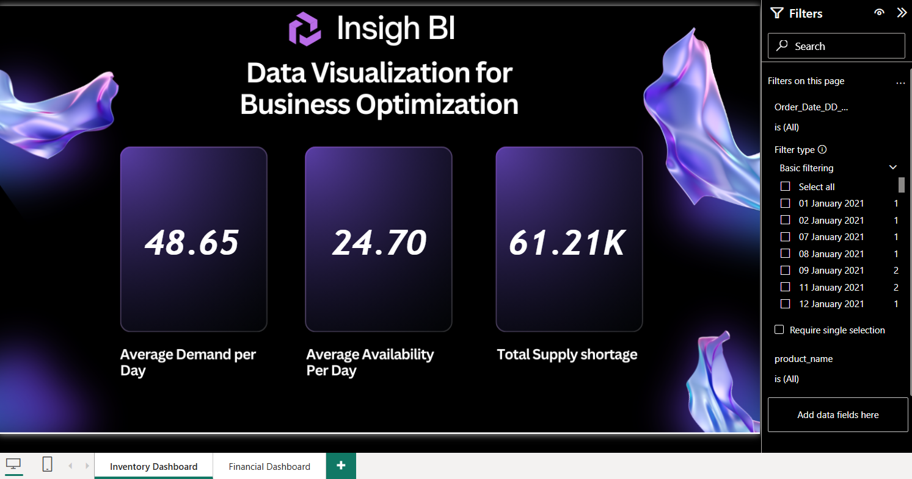
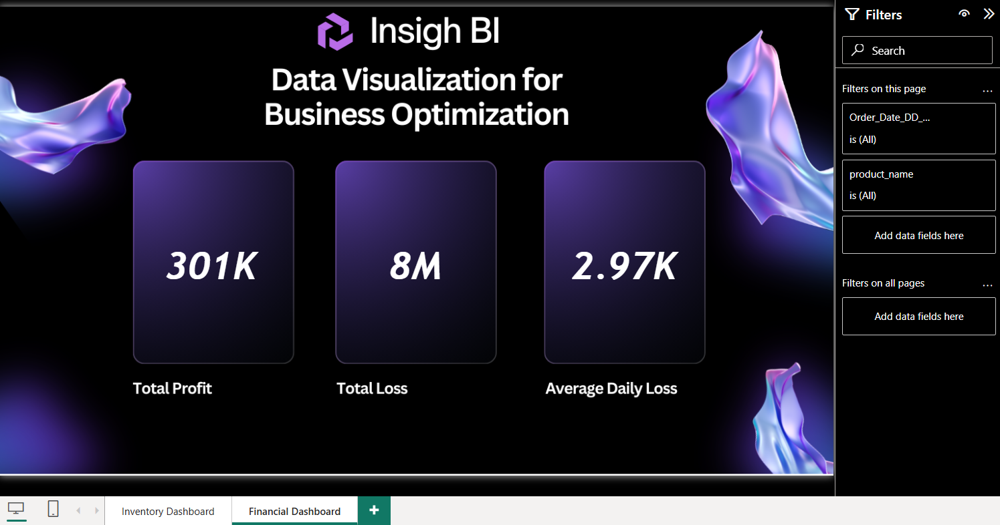

# 📦 Project 2 – Inventory Data Analysis (Power BI)

This project focuses on analyzing inventory data using **Microsoft Power BI**.  
The objective is to monitor inventory performance, identify shortages, and evaluate financial impact through **interactive dashboards and KPIs**.

The project demonstrates a real-world workflow including **data integration from SQL Server, DAX calculations, report building, and data source migration to MySQL**.

---

## 📸 Dashboard Preview

### 🟢 Inventory Insights (Page 1)

### 🔵 Financial Insights (Page 2)

---

## 📑 Table of Contents

- [Project Overview](#-project-overview)
- [Report Structure](#-report-structure)
- [Connecting Power BI with SQL Server](#-1-connecting-power-bi-with-sql-server)
- [DAX Measures & KPI Development](#-2-dax-measures--kpi-development)
- [Production Deployment](#-3-production-deployment)
- [Switching Data Source (SQL Server → MySQL)](#-4-switching-data-source-sql-server--mysql)
- [Tools & Technologies](#-tools--technologies)
- [Deliverables](#-deliverables)
- [Learning Outcomes](#-learning-outcomes)
- [Author](#-author)

---

## 🎯 Project Overview

The Inventory Data Analysis report helps in understanding:

- Demand vs Availability  
- Supply shortages  
- Profit and loss tracking  
- Daily inventory performance  

The report is designed as a **two-page interactive dashboard** with filter capabilities to allow dynamic data exploration.

---

## 📊 Report Structure

### 🟢 Page 1 – Inventory Insights

This page focuses on operational inventory metrics:

- **Average Demand Per Day**  
- **Average Availability Per Day**  
- **Total Supply Shortage**  

📌 Features:
- Card visuals for quick KPI tracking  
- Filter Pane for dynamic analysis  
- Helps identify gaps between demand and supply  

---

### 🔵 Page 2 – Financial Insights

This page highlights financial impact:

- **Total Profit**  
- **Total Loss**  
- **Average Daily Loss**  

📌 Features:
- Financial KPI tracking  
- Interactive filtering  
- Helps evaluate business performance  

---

## 📥 1. Connecting Power BI with SQL Server

- Connected **Microsoft SQL Server** as the primary data source  
- Imported data into **Power BI Desktop**  
- Worked initially with a **Test Environment**  
- Loaded test datasets for development and validation  

---

## 🧮 2. DAX Measures & KPI Development

Created key measures using **DAX (Data Analysis Expressions)**:

- Average Demand Per Day  
- Average Availability Per Day  
- Total Supply Shortage  
- Total Profit  
- Total Loss  
- Average Daily Loss  

These measures were first validated using **test data** before deployment.

---

## 🚀 3. Production Deployment

- Switched from **Test Environment to Production Environment**  
- Imported production datasets into SQL Server  
- Updated Power BI to reflect production data  
- Ensured all visuals and KPIs remained accurate  

---

## 🔄 4. Switching Data Source (SQL Server → MySQL)

To simulate a real-world business scenario:

- Changed the data source from **SQL Server to MySQL**  
- Installed and configured **MySQL Connector**  
- Imported production data into MySQL  
- Reconnected Power BI to MySQL  

✅ Key Highlight:
- **All DAX measures remained unchanged**  
- Ensured seamless transition across database systems  

📌 Final Step:
- Performed **data validation** to confirm accuracy after migration  

---

## 🛠 Tools & Technologies

- Microsoft Power BI  
- DAX (Data Analysis Expressions)  
- Microsoft SQL Server  
- MySQL Database  
- Power Query Editor  
- Data Modeling  

---

## 📌 Deliverables

- Two-page interactive Power BI report  
- Inventory and financial KPI dashboards  
- SQL Server & MySQL integrated datasets  
- DAX-based calculated measures  
- Data source migration demonstration  

---

## 🎯 Learning Outcomes

Through this project, you will learn:

- Connecting Power BI with multiple databases  
- Working with test and production environments  
- Writing and validating DAX measures  
- Building KPI-driven dashboards  
- Handling data source migration (SQL Server → MySQL)  
- Ensuring data consistency across systems  

---

## 👤 Author

**Mohammad Umer Jan**  
LinkedIn: https://www.linkedin.com/in/mohammad-umer-jan-b41303261  